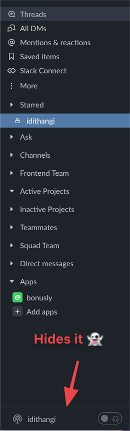

# Hide Huddles for Slack

> Slack's Huddle became hurdle for some. This tiny extension hides it so you can focus on real things

## Features

Well, it just hides [Slack's huddle](https://slack.com/intl/en-in/help/articles/4402059015315-Introducing-Slack-Huddles-a-new-way-to-have-live-audio-discussions).

That's it.

#DoOneThingDoItWell

## Credits

- Extension Boilerplate based on [browser-extension-template](https://github.com/notlmn/browser-extension-template)
- Extension icon made by [Icons8](https://icons8.com/icons/set/slack)

<!-- ## Install

You can install it from the [Chrome Web Store](https://chrome.google.com/webstore/detail/just-meet/hkheplanjmdcfhodikenfkgceffndbgj) -->

## License

MIT © [Nesin Technologies LLP](https://nesin.io)
